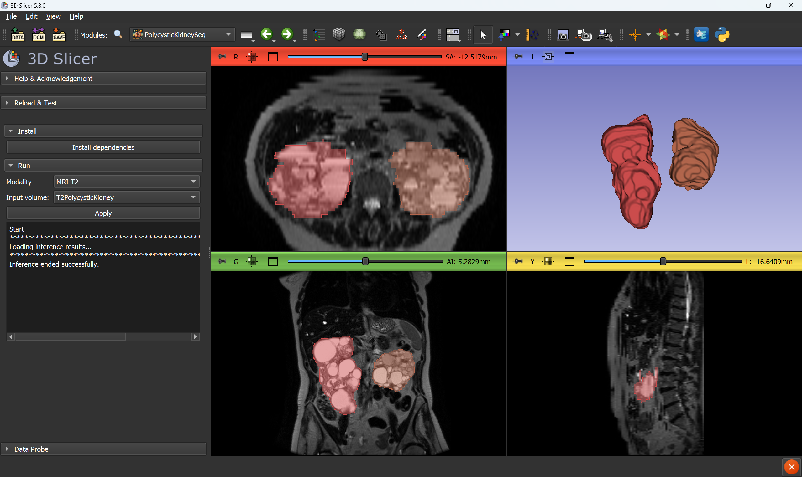

# PolycysticKidneySeg

3D Slicer extension for fully automated polycystic kidneys segmentation based on "pkdia" AI model developed by Pierre-Henri Conze (IMT Atlantique) and described in

> P.-H. Conze et al., Dual-task kidney MR segmentation with Transformers in autosomal-dominant polycystic kidney disease. Computerized Medical Imaging and Graphics, 2024.

Test files can be downloaded on the [releases page](https://github.com/conze/SlicerPKDIA/releases/).

## Tutorial

- Start 3D Slicer

- Go to `PolycysticKidneySeg` module

- Use `Install dependencies` button if needed

- Select desired modality (T2 by default)

- Select a loaded volume on which to perform the segmentation

- Click `Apply`

- The processing can take several minutes, after which the produced segmentation will be loaded in the open views

## Acknowledgements

This work was funded by the Société Francophone de Néphrologie, Dialyse et Transplantation (SFNDT).

Models were developed and trained by Pierre-Henri Conze (IMT Atlantique) using imaging data from the Genkyst cohort.

Please refer to the following paper:

> P.-H. Conze et al., Dual-task kidney MR segmentation with Transformers in autosomal-dominant polycystic kidney disease. Computerized Medical Imaging and Graphics, 2024.

The 3D Slicer extension was developed by Jonathan Bouyer (Kitware SAS), Thibault Pelletier (Kitware SAS) and Julien Finet (Kitware SAS).
